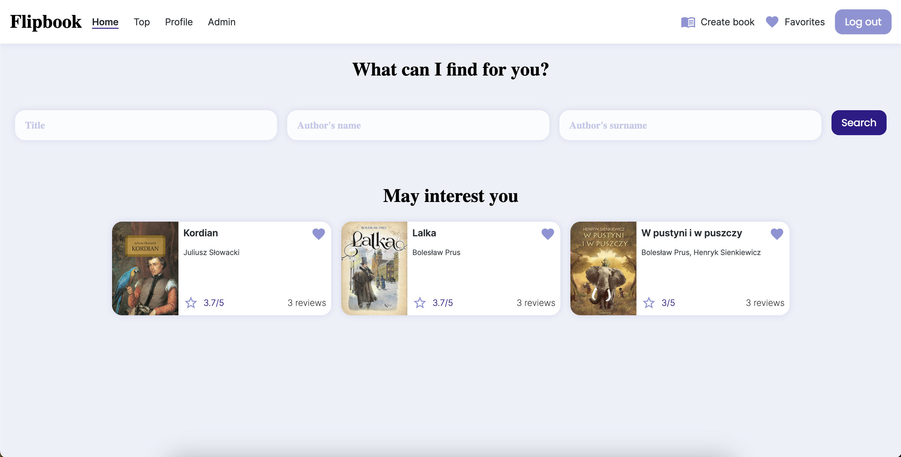
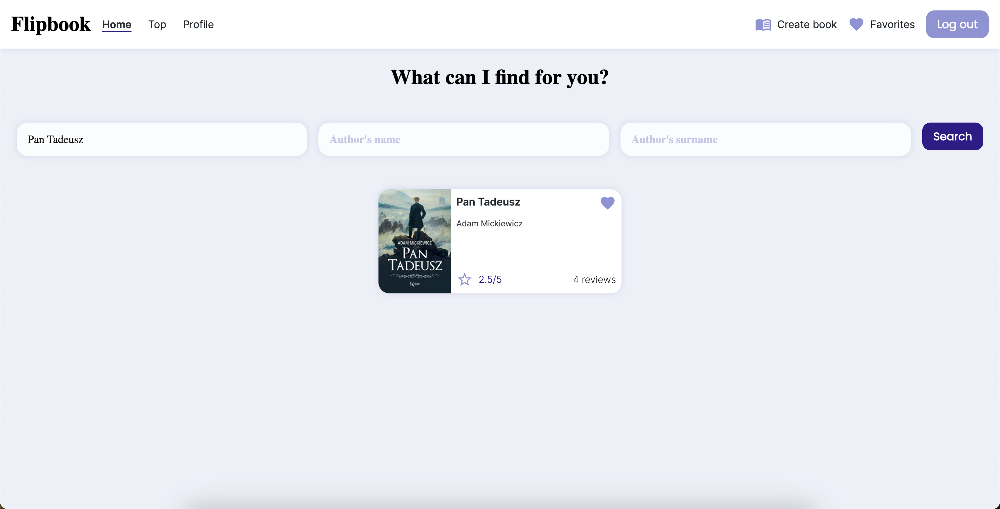
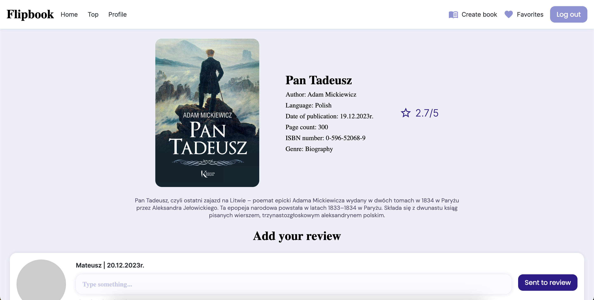
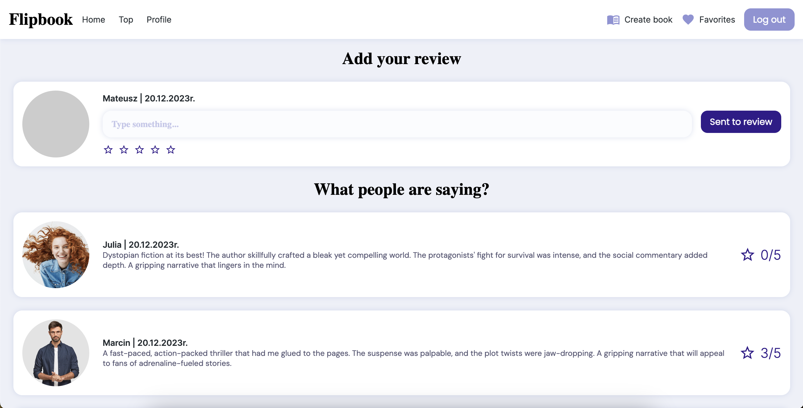
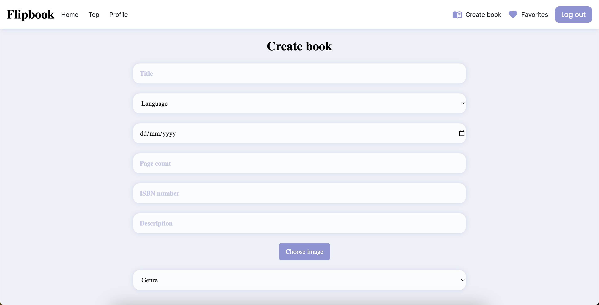
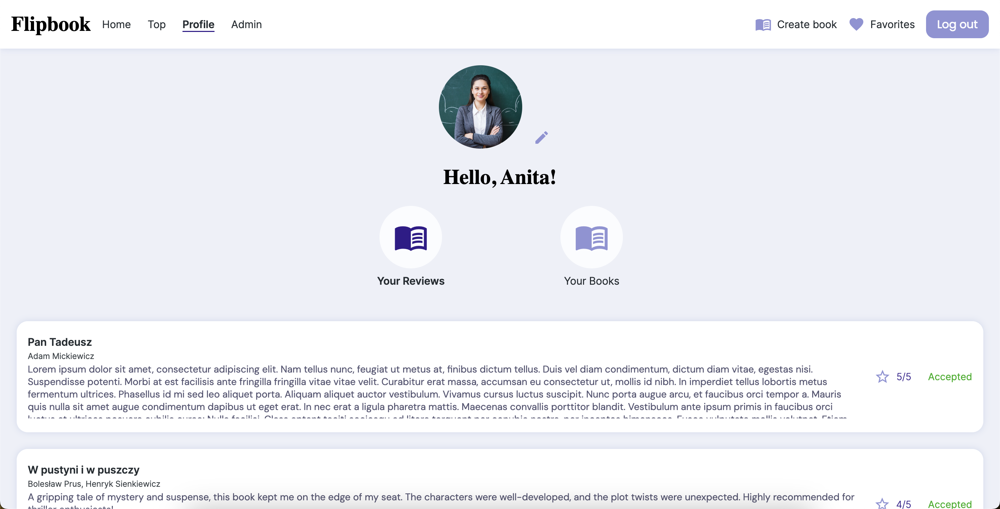
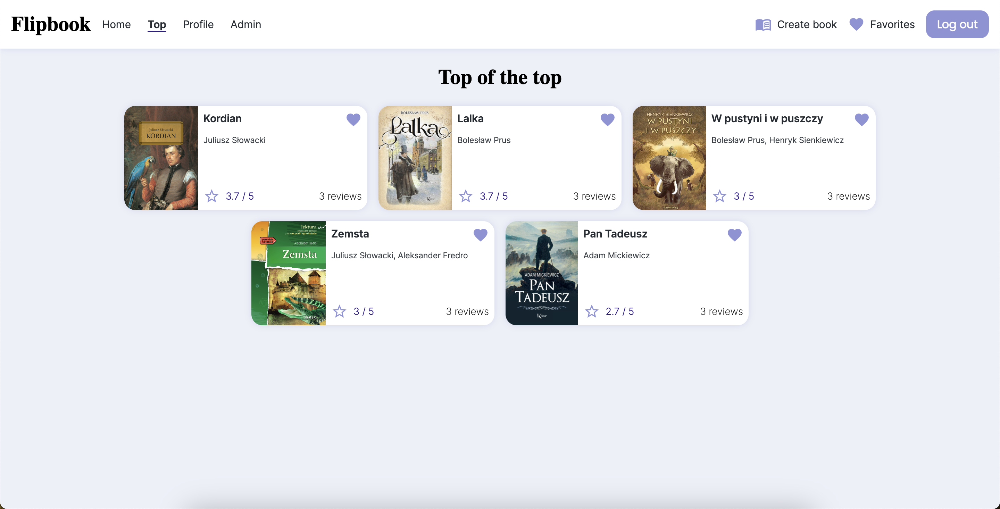

# Flipbook

## Overview
Flipbook is convenient web app for exploring books and sharing your reading experiences. Easily search our database to find information on your favorite reads and discover what others think through user reviews. If you're a registered user, express your opinions by adding reviews or contribute by suggesting new books—admin approval ensures content quality. Keep track of your contributions and favorite books in your user profile. Join Flipbook and make your reading journey more interactive and engaging.

## Table of Contents
- [Get Started](#get-started)
  - [Prerequisites](#prerequisites)
  - [Installation](#installation)
- [Features](#features)

## Get Started
Welcome to Flipbook, your go-to web app for exploring and sharing books! Follow these simple steps to get started:

### Prerequisites

- Docker

### Installation

To get started, download Docker and run the following commands: `docker-compose build` followed by `docker-compose up`. Once completed, open http://localhost:8080/ in your browser. 

## Features

1. Recommendations
Discover new reads through our "May Interest You" section, where we highlight the top 3 books based on the average of all accepted reviews.

2. Searching for Books
Use the search feature to find books that interest you. Enter keywords like titles or authors. Here's an example:

3. Viewing Book Details
Click on a book card to view its details. You'll find information such as the title, authors, description, and more. Example:

4. Adding Reviews
If you're registered and logged in, you can share your opinions by adding reviews. Navigate to the book details page and use the "Sent to review" button. Example:

5. Adding New Books
Logged-in users can contribute by adding new books. Click on the "Create book" button, fill in the details, and submit for review by admins. Example:

6. Managing Your Profile
As a registered user, you can track your submitted books and reviews in your profile. 

7. Top Books
Explore the "Top" page to find all books sorted by the average rating of reviews. See what the community considers the best reads.

## Contact

e-mail: anita.sajdak123@gmail.com
linkedin: https://www.linkedin.com/in/anita-sajdak-02a254243/